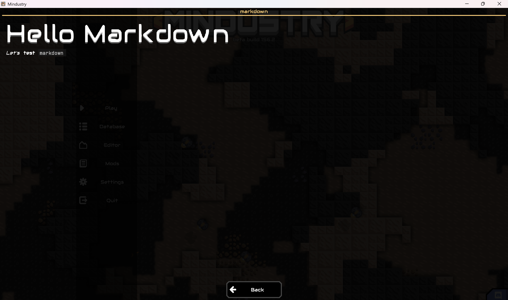
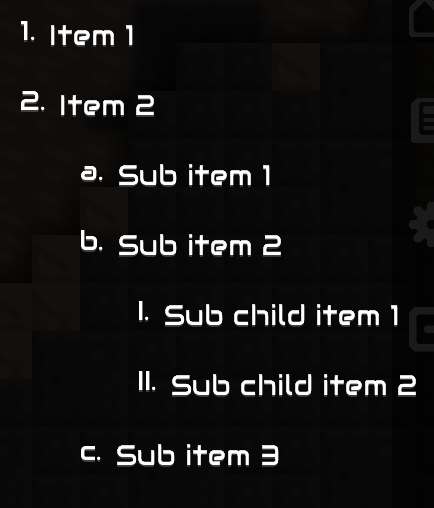
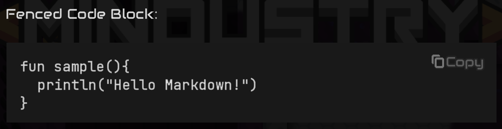
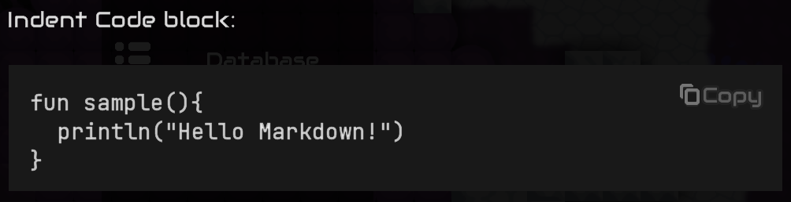

## Markdown

此模块提供渲染Markdown文本的UI工具，包含一个核心的类型`Markdown`及其周边的一系列工具，对标准的Markdown格式进行了实现，同时也提供了完备的抽象用于添加或修改自定义行为。

### 快速开始

您可以通过如下方式添加对此模块的依赖：

Gradle：

```groovy
dependencies {
  implementation 'com.github.EBwilson:UniverseKit:markdown:$version'
}
```

Maven：

```xml
<dependency>
    <groupId>com.github.EB-wilson.UniverseKit</groupId>
    <artifactId>markdown</artifactId>
    <version>[version]</version>
</dependency>
```

Markdown模块的核心类型为`universe.ui.markdown.Markdown`，它包含一个主要构造函数：

```kotlin
Markdown(
  content,  //: String
  style,    //: MarkdownStyle
  provider, //: MarkdownProvider, default = BaseProvider()
)
```

其中各参数含义：

- `content`：Markdown的原始文本内容，格式请参阅[Markdown官方教程](https://markdown.com.cn/basic-syntax/)。
- `style`：此Markdown的绘制样式，包括各类文本使用的字体，行间距及块间距等。
- `provider`：渲染Markdown的工厂，提供解析与渲染的扩展对象及实际构造绘制目标的相关功能，是自定义行为的核心目标。

其中`provider`具有一个`BaseProvider()`的默认值，它定义了对常规Markdown规范的默认实现，而自定义Markdown语法或渲染行为也通常是通过继承并重写此类型的函数来实现。

`style`描述此Markdown的布局与绘制样式，如果您是在**Mindustry mod**环境中使用Markdown，则您可以在`MarkdownStyles`单例中获取Mindustry风格的默认样式。

以下是一个简单的默认用例：

```kotlin
fun sample(){
  val dialog = BaseDialog("markdown")
  val markdown = Markdown(
    """
    # Hello Markdown
    
    *Let's* **test** `markdown`
    """,
    MarkdownStyles.defaultMD
  )
  
  dialog.addCloseButton()
  dialog.cont.add(markdown).grow().pad(20f)
  dialog.show()
}
```

此例中使用默认的Markdown实现与Mindustry默认样式，运行`sample()`，您将会看到如下画面：



Markdown中仅有一个属性`wrapContent`，它表示这个Markdown是否依据布局宽度自动换行，默认为真。

需要注意的是，当`wrapContent`为真时，此Markdown的最适宽度（`getPrefWidth()`）会被设为0，此状态下您不应以Markdown内容为参考进行布局。

这类似于`Label`，当您将`wrapContent`设为`false`后，Markdown将不会自动换行，并自动计算其所占宽度。

### 支持的语法

本工具实现了**除内嵌HTML**外的绝大部分Markdown标准规范及部分常用扩展语法，如下：

#### 多级标题

由若干`#`号起始的行，`#`数量也代表标题级别。标题还会被记录到章节索引中，您可以通过对Markdown调用其`findChapter`函数来获取某一章节的标题位置。

  ```md
  # Heading 1
  ## Heading 2
  ### Heading 3
  #### Heading 4
  ##### Heading 5
  ###### Heading 6
  ```
  
  

#### 强调

由`*`号或`_`号包围的内嵌文本。多次嵌套只会在强调和增强强调间来回切换。

```md
*Emphasize*

**Strong**

___Strong Emphasize___
```


#### 下划线

使用一对两个加号`++`包围的文本，通常也被用于强调。

```md
++Under line++
```


_此语法为扩展的Markdown方言，并非Markdown的标准语法特性。_

#### 删除线

使用一对两个波浪号`~~`包围的文本，在文本正中划线表示删除。

```md
~~Strikethrough~~
```


#### 链接

一个指向某一URL的超链接文本，结构形如`[Link](URL)`的文本块。当链接被点击时，Markdown会发出一个`UrlClickedEvent`事件，携带被点击的链接在UI层次结构中传递。

```md
[A Link](https://github.com/EB-wilson/UniverseKit)
```


同时Markdown也实现了引用链接定义，您可以通过如下形式定义可引用链接：
```md
[RefName]: url
```

并以`[Link][ReferenceURL]`形式的引用到定义的链接，引用链接可以定义在全文的任意位置，通常它们都不参与渲染。

```md
[A Reference Link][RefLinkDef]

[RefLinkDef]: https://github.com/EB-wilson
```


#### 遮幕

由一对`$`符号包围的文本块，渲染时会使用黑色的前景遮盖这段文本块，仅在将光标移动到遮幕上（或者在触屏上按住）时文本内容才会显现。

```md
$This is a Curtain$
```

未悬停时：


鼠标悬停时：


_此语法为扩展的Markdown方言，并非Markdown的标准语法特性。_

#### 内联代码

由``` ` ```号包围的内嵌文本，使用等宽字体。

```md
`Code`
```


#### 引用块 
 
由`>`符号开头的多个连续行组成的块文本，其内容会被包围在一个背景框体内。

```md
> Quote Block Line 1  
> Quote Block Line 2  
> Quote Block Line 3  
```


#### 分割线

由至少三个`-`或`*`号构成的单个行，它用于分隔开文档的各个部分，更多的符号没有任何特殊效果。

```md
Part 1

---

Part 2
```


#### 列表

由一系列缩进一致的`-`或数字序号开头的多个行，缩进量可表达列表等级。

无序表列：
```md
- List item 1
- List item 2
- List item 3
  - Sub list item 1
  - Sub list item 2
- List item 4
```

  

有序列表：
```md
1. Item 1
2. Item 2
   1. Sub item 1
   2. Sub item 2
      1. Sub child item 1
      2. Sub child item 2
   3. Sub item 3
```



#### 围栏代码块

由一对` ``` `包围的一块多行文本，首个` ``` `后可跟随一个附加信息用于描述代码所用语言等。

<pre><code>Fenced Code Block:

```kotlin
fun sample(){
  println("Hello Markdown!")
}
```</code></pre>



#### 缩进代码块

由至少4个空格缩进的多个并列行视为一个缩进代码块，除不能标注附加信息外，它与围栏代码块作用类似。

```md
Indent Code block:

    fun sample(){
      println("Hello Markdown!")
    }
```



#### 图片

引用自URL路径的图像资源，由``形式进行定义。

URL路径包含若干默认定义，目前支持多种URL协议：

- `http`/`https`：超文本传输协议，用于从web地址获取图像资源

  例如：`https://github.com/EB-wilson/Helium/blob/master/icon.png
- `file`：本地文件路径，从本机的文件系统中定位文件资源，注意，这使用的是客户端上的文件，并不会将编译时设备上的文件打包，较少使用。

  例如：`file:///C:/User/UserName/images/sample.png`
- `resource`：jar资源路径，从当前程序的jar包中索引资源文件，以jar包为根目录。

  例如：`resource://sprites/items/sample.png`
- `atlas`：Atlas索引，从游戏已加载的精灵序列中搜索具有给定名称的图像资源，直接提供图像的精灵名称。

  例如：`atlas:item-copper`
- `data`：此URL直接以文本方式编码资源内容，对于图像应为Base64编码方式。

  例如：`data:image/png;base64,iVBORw0KGgoAAAANSUhEUgAAAJcAAADlCAYAAABedWWzAAA...`

```md


![Data Image](data:image/jpeg;base64,/9j/2wCEAAgGBgcGBQgHBwcJCQgKDBQNDAsLDBkSEw8UHRofHh0aHBwgJC4nICIsIxwcKDcpLDAxNDQ0Hyc5PTgyPC4zNDIBCQkJDAsMGA0NGDIhHCEyMjIyMjIyMjIyMjIyMjIyMjIyMjIyMjIyMjIyMjIyMjIyMjIyMjIyMjIyMjIyMjIyMv/AABEIAEAAQAMBIgACEQEDEQH/xAGiAAABBQEBAQEBAQAAAAAAAAAAAQIDBAUGBwgJCgsQAAIBAwMCBAMFBQQEAAABfQECAwAEEQUSITFBBhNRYQcicRQygZGhCCNCscEVUtHwJDNicoIJChYXGBkaJSYnKCkqNDU2Nzg5OkNERUZHSElKU1RVVldYWVpjZGVmZ2hpanN0dXZ3eHl6g4SFhoeIiYqSk5SVlpeYmZqio6Slpqeoqaqys7S1tre4ubrCw8TFxsfIycrS09TV1tfY2drh4uPk5ebn6Onq8fLz9PX29/j5+gEAAwEBAQEBAQEBAQAAAAAAAAECAwQFBgcICQoLEQACAQIEBAMEBwUEBAABAncAAQIDEQQFITEGEkFRB2FxEyIygQgUQpGhscEJIzNS8BVictEKFiQ04SXxFxgZGiYnKCkqNTY3ODk6Q0RFRkdISUpTVFVWV1hZWmNkZWZnaGlqc3R1dnd4eXqCg4SFhoeIiYqSk5SVlpeYmZqio6Slpqeoqaqys7S1tre4ubrCw8TFxsfIycrS09TV1tfY2dri4+Tl5ufo6ery8/T19vf4+fr/2gAMAwEAAhEDEQA/APe2niU4Mi59M80GYZwFY/hj+dQ3NoJTvX73p61jyzT27cFlpNspJM25JjGhdtqgfjVd7ubb2Un7o24/qarWMzTSFpn3EYEYPrzk1c8kOSe57n0pXYWS3IYZrtxumcKB6c1JBqUUj+Wc7+2O9OaDMJUE9OOcVl2yos6y53lTgL6f/Xqo2adyJtpqxvggjIOQaWoeUO5endfX/wCvUoIYAg5BoGN2HOflqC7WPyHeZVKqOferLMFGT0rK1WbzYkiUfxbyPYf5FOz6Cuk9SpZYaNXGVJyFz7k81pLOEfYx7cZrGultrvTYhNGpQyJvRuOpwPpzjmrOm6VPZWPkyXbT4ckGQZIXHC561ld3N3FNXuX5LhjbLIow3BK/zFcrqGofZdSgjWYRSXMhEZY7Rkc4J7H27+9XrW61Z9SurS7tVaBcmO5jIXI7fL61QvtMstWuMahbwXHlMQoaPkYznJzyPbpVQlZ3JqUfss6VL91wGUN6kUqakqS9CUb7w9D6isbTImtoXRpPMh+URgkttxkH39OPrV9lCKzuqADp15q1BvYmUorc0L+6aPCKmR/EfSssxltzFpMMxwynk/SppCxdpTJvXGSCMAe2KlSI+QrSHa+35uwT2q5S5FZGUVzbnL6tJcB1gt1BiCMkiOw+Y4OMk9OSOfUVn674l8ReFoYlW3iv1lcqgRCNgC9z9cc9PpVzXhdyWt7LYo4jCBYnCbiePvKPXPT865HUr6/074fWsqxtfSyplpZH3GHcevPJHTAqocrVn6sVVzTuvRf8E7HwDq2u64t/ca3DDAytGIY4yOF5yTyf8ioredm1OaXcDB5r7sf3iwI788DFZnwyt7XT9Mt4rGVWur1Bc3kxbO1VbAQD1yefx9Rjc06WzXxhrOjqka70juIgBgMNuHH54P51jdJ6LQ2s2rN6mpp211ZfnMe7klenHv8AU1sxRrJaeU4+7levT0qitvFbMUThGXIjx9f0qxC3lnHQYqpzW0RRg7alKWfasYILrvBBH8QzzmqWpahPMFjKfu3cIVHp3/Sm6hfC2WWUj7mSVHZcD/GuQ1PxObdPKgceeRln67SfT3/z7Uq7s9Qw65ldHoOoahHbRIsAQvn5AeR0xiq8ek2esWb219ApizuYA4JPXr2FYfgzw0ph/tfUWle6mP7tZGOVX1+p/lXVXF3p+lXkUd3cRwtcA+X5jYBK9R6dxQmmrjas7IzdI8I6Z4evpL6wRkFxGEZWctg5zkZ9e/0Fc94pSK08U2d6EeG6VN8cyNgsFOCCOh4b8s12V1rWlRwqJL+3ODwBICSewrjfGWkahq6W89rJHHNBIZIw/IOeCMjpTSbWgJ2d2dlDeWt/bI8NwoDjcvIyp9P8+lNkmYAB9hbHDJ0YVwegXlzZ3Cxz2e0lgZYTztwfvKe6nFdpPb21xdzWkEqrOi7htPK89CPxH51FujHJNarU/9k=)
```


此外，您还可以为图像设置其长/宽以及缩放方式，通过在图像块后方跟随一段由`{}`包围的块体，并在其中以`key=value`的形式提供`width`，`height`以及`scaling`以使图像按预期的大小进行缩放。

其中，`scaling`定义与Image元素使用的`Scaling`枚举相同，您应当使用此枚举中提供的缩放方式。

```md
{width=120 scaling=fillX}

{width=120 height=180 scaling=stretch}
```


